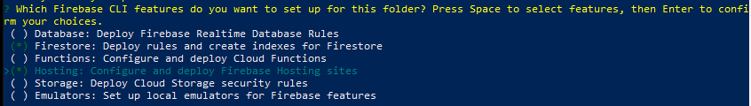
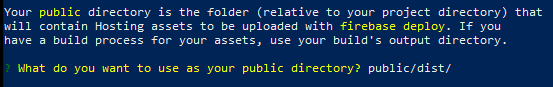
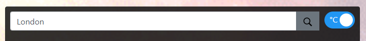

# Weather App

> Weather App written in JavaScript to search for the forecast of cities and have the option of seeing it in Celsius and Fahrenheit.


## Built With

- JavaScript
- Webpack
- ESLint
- StyleLint
- Firebase Hosting

## Live Demo

[Live Demo Link](https://weather-app-4562.web.app/)


## Getting Started

To get a local copy up and running follow these simple example steps.

### Prerequisites

- Create a firebase [account](https://console.firebase.google.com/)
- Install [firebase CLI](https://firebase.google.com/docs/cli)
- Install [Node](https://nodejs.org/en/)

### Setup

From the command line/terminal clone the repository:

```
$ git clone https://github.com/abdelp/todo-list-js.git
```

Initialize the firebase hosting service

```
$ firebase init
```

Select firestore and hosting features:



Select /dist as the public directory:



### Usage

To get the forecast of a city, you only need to put the name of the city in the search bar and press enter or click the search button on the right.



### Deployment

To deploy on your local environment run:

```
$ firebase serve
```

To deploy to your firebase production environment:

```
$ firebase deploy
```

## Author

👤 **Abdel Pérez**

- Github: [@abdelp](https://github.com/abdelp/)
- Twitter: [@AbdelPerez11](https://twitter.com/abdelperez11)
- Linkedin: [Abdel Pérez](https://www.linkedin.com/in/abdel-perez/)

## 🤝 Contributing

Contributions, issues and feature requests are welcome!

Feel free to check the [issues page](issues/).

## Show your support

Give a ⭐️ if you like this project!

## Acknowledgments

- Hat tip to anyone whose code was used
- Inspiration
- etc

## 📝 License

This project is [MIT](lic.url) licensed.